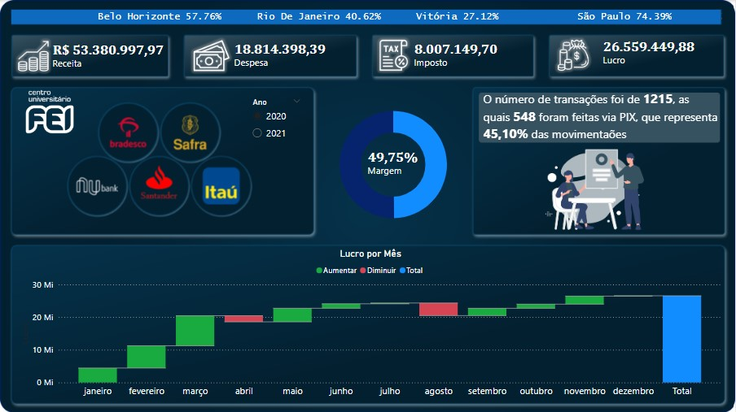

# Dashboard Controle Logistica
## 1. Problema de Negócio
O setor Financeiro da empresa, com foco no gerenciamento de patrimônio, receito e lucro, solicitou um dashboard para acompanhamento de métricas que possam ajuda-los a entender melhor a situação financeira atual da empresa, auxiliando também na tomada de melhores decisões. 
- Algumas das métricas são: Receita, Lucro, Impostos, DEspesas, total de transações, métodos de transações, Lucro por Mês, entre outros.

## 2. Estratégia da Solução
- Planejada uma análise descritiva como suficiente para atender ao problema de negócio.
- Foi desenvolvido um dashbord agrupando as métricas financeiras da base de dados fornecida pelo setor.

### 2.1 Imagem do Dashboard

## 3. Tecnologias usadas
- **Excel:** Recebimento da base de dados original;
- **Power BI:** Tratamento de dados, construção de tabelas métricas e dashboard.

## 4. Como executar o projeto
- Acesse o arquivo "Controle_Financeiro.pbix";
- Utilize os filtros e gráfico interativos para visualização das métricas.

## 5. Top 3 Insights de dados
- As transações envolvendo o banco NuBank são as que possuem menor Margem de Lucro (Lucro/Receita), aproximadamente 7,4% em 2020 e -3,69% em 2022.
  - Sugestão: Realizar uma **análise diganóstica** para entender o porque o NuBank possui menor margem. Permitindo que a equipe financeira tome uma melhor decisão sobre a parcerias ou incentivos envolvendo este banco.
- O método detransações financeiras mais utilizado foi o PIX em todos os bancos
  - Sugestão: Estudar a possibilidade de incentivos em transações por PIX.
- O lucro de 2021 foi 13% menor que no ano anterior. Isso proque a receita de 2021 foi menor enquanto as despesas maiores.
  - Sugestão: Realizar uma **análise diganóstica** e um estudo com a equipe financeira para entender o porque da receita ter diminuido e as despesas terem aumentado.

## 6. Próximos Passos
1. Automatização do dashboard após novo recebimento de dados.
2. Realizar uma análise diagnóstica para estudo dos insights sugeridos no item 5 e outras solicitações da equipe de RH.